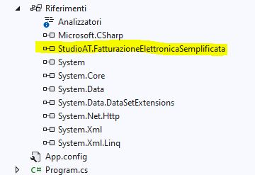

## Fatturazione elettronica semplificata

### Descrizione
La libreria è stata sviluppata in c# in base alla documentazione fornita al seguente link [Documentazione Fatturazione elettronica](https://www.agenziaentrate.gov.it/portale/web/guest/fatturazione-elettronica-e-dati-fatture-transfrontaliere-new)

La libreria è completa di tutti i type per creare una fattura completa con le specifiche [v. 1.6](https://www.agenziaentrate.gov.it/portale/web/guest/specifiche-tecniche-versione-1.6)  in base alle proprie esigenze

Possono essere create fatture con schema 1.0, 1.0.1

La versione 1.0.1 è la versione corrente dello schema

Sono presenti i seguenti metodi:

- *TryValidateXML* per validare la fattura

- *CreateXML* per generale il file XML

- *CreateInvoice* per generare l'oggetto fattura da file XML o stream

- *GetProgressivoFile*
```csharp
            // codifica in base36 per 5 caratteri (range 1..60466176 (ProgressivoFile.GetNumeroProgressivo("ZZZZZ")))
            ProgressivoFile progressivoFile = new ProgressivoFile(1);
            if (progressivoFile.IsValid())
            {
                string nomeFile = $"IT01234567890_{progressivoFile.GetProgressivoFile()}";
            }  
```
- *GetVersion* per restituire l'attributo versione dell'xml da file o stream

### Requisiti

E' richiesto il framework Microsoft .NET 4.6.2

### Esempio di creazione fattura



```csharp
#define Fattura
#define v101

using FatturazioneElettronicaSemplificata;

using FatturazioneElettronicaSemplificata.Type.V_1_0_1;
//using FatturazioneElettronicaSemplificata.Type.V_1_0;

using System;
using System.Collections.Generic;

namespace FatturazioneElettronicaSamples
{
    internal class Program
    {
        static void Main(string[] args)
        {
#if Fattura
            FatturaElettronicaType fatturaElettronica = new FatturaElettronicaType();


#if v101 || v10
            fatturaElettronica.versione = FormatoTrasmissioneType.FSM10;
#endif


            FatturaElettronicaHeaderType fatturaElettronicaHeaderType = new FatturaElettronicaHeaderType();

            DatiTrasmissioneType datiTrasmissioneType = new DatiTrasmissioneType();

            IdFiscaleType idFiscaleTypeTrasmissione = new IdFiscaleType();
            idFiscaleTypeTrasmissione.IdCodice = "01234567890";
            idFiscaleTypeTrasmissione.IdPaese = "IT";

            datiTrasmissioneType.IdTrasmittente = idFiscaleTypeTrasmissione;
            datiTrasmissioneType.ProgressivoInvio = "00001";

#if v101 || v10
            datiTrasmissioneType.FormatoTrasmissione = FormatoTrasmissioneType.FSM10;
#endif
            datiTrasmissioneType.CodiceDestinatario = "0000000";

            fatturaElettronicaHeaderType.DatiTrasmissione = datiTrasmissioneType;

            CedentePrestatoreType cedentePrestatoreType = new CedentePrestatoreType();


            IdFiscaleType idFiscaleTypeCedente = new IdFiscaleType();
            idFiscaleTypeCedente.IdPaese = "IT";
            idFiscaleTypeCedente.IdCodice = "01234567890";

            cedentePrestatoreType.IdFiscaleIVA = idFiscaleTypeCedente;
            cedentePrestatoreType.CodiceFiscale = "01234567890";
            cedentePrestatoreType.ItemsElementName = new ItemsChoiceType[] { ItemsChoiceType.Denominazione };
            cedentePrestatoreType.Items = new string[] { "ALPHA SRL" };

            cedentePrestatoreType.RegimeFiscale = RegimeFiscaleType.RF18;

            IndirizzoType indirizzoType = new IndirizzoType();
            indirizzoType.Indirizzo = "VIALE ROMA";
            indirizzoType.NumeroCivico = "543";
            indirizzoType.CAP = "07100";
            indirizzoType.Comune = "SASSARI";
            indirizzoType.Provincia = "SS";
            indirizzoType.Nazione = "IT";
            cedentePrestatoreType.Sede = indirizzoType;

            fatturaElettronicaHeaderType.CedentePrestatore = cedentePrestatoreType;

            CessionarioCommittenteType cessionarioCommittenteType = new CessionarioCommittenteType();
            AltriDatiIdentificativiType altriDatiIdentificativiType = new AltriDatiIdentificativiType();
            IdentificativiFiscaliType identificativiFiscaliType = new IdentificativiFiscaliType();
            identificativiFiscaliType.CodiceFiscale = "11111111111";
            identificativiFiscaliType.IdFiscaleIVA = new IdFiscaleType() { IdCodice = "11111111111", IdPaese = "IT" };
            cessionarioCommittenteType.IdentificativiFiscali = identificativiFiscaliType;


            altriDatiIdentificativiType.Items = new string[] { "SOC. TAU" };
            altriDatiIdentificativiType.ItemsElementName = new ItemsChoiceType2[] { ItemsChoiceType2.Denominazione };


            IndirizzoType indirizzoTypeCommittente = new IndirizzoType();
            indirizzoTypeCommittente.Indirizzo = "VIA RIMINI 2-B";
            indirizzoTypeCommittente.CAP = "00145";
            indirizzoTypeCommittente.Comune = "ROMA";
            indirizzoTypeCommittente.Provincia = "RM";
            indirizzoTypeCommittente.Nazione = "IT";

            altriDatiIdentificativiType.Sede = indirizzoTypeCommittente;

            cessionarioCommittenteType.AltriDatiIdentificativi = altriDatiIdentificativiType;

            fatturaElettronicaHeaderType.CessionarioCommittente = cessionarioCommittenteType;
            fatturaElettronica.FatturaElettronicaHeader = fatturaElettronicaHeaderType;

            FatturaElettronicaBodyType fatturaElettronicaBodyType = new FatturaElettronicaBodyType();
            DatiGeneraliType datiGeneraliType = new DatiGeneraliType();

            DatiGeneraliDocumentoType datiGeneraliDocumentoType = new DatiGeneraliDocumentoType();
            datiGeneraliDocumentoType.Numero = "111011122";
            datiGeneraliDocumentoType.TipoDocumento = TipoDocumentoType.TD07;
            datiGeneraliDocumentoType.Divisa = "EUR";
            datiGeneraliDocumentoType.Data = new DateTime(2021, 9, 21);


            datiGeneraliType.DatiGeneraliDocumento = datiGeneraliDocumentoType;
            fatturaElettronicaBodyType.DatiGenerali = datiGeneraliType;

            DatiBeniServiziType datiBeniServiziType = new DatiBeniServiziType();
            datiBeniServiziType.Descrizione = "TOTALE IMPOSTA IN ADDEBITO";
            datiBeniServiziType.Importo = 50.42M;
            datiBeniServiziType.DatiIVA = new DatiIVAType() { Imposta = 5.42M, ImpostaSpecified = true };
            fatturaElettronicaBodyType.DatiBeniServizi = new DatiBeniServiziType[] { datiBeniServiziType };

#if allegati
        //allegati
        string filePathAttachment = @"c:\temp\scratch\prova.pdf";
        if (File.Exists(filePathAttachment))
        {
            List<AllegatiType> allegatiTypes = new List<AllegatiType>();
            AllegatiType allegatiType = new AllegatiType();
            allegatiType.NomeAttachment = Path.ChangeExtension(Path.GetFileName(filePathAttachment), "zip");
            allegatiType.AlgoritmoCompressione = "zip".ToUpperInvariant();
            allegatiType.FormatoAttachment = Path.GetExtension(filePathAttachment).TrimStart('.').ToUpperInvariant();

            byte[] fileBytes = File.ReadAllBytes(filePathAttachment);
            byte[] compressedBytes = null;

            //creo lo zip in memoria
            using (var outStream = new MemoryStream())
            {
                using (var archive = new ZipArchive(outStream, ZipArchiveMode.Create, true))
                {
                    var fileInArchive = archive.CreateEntry(filePathAttachment, CompressionLevel.Optimal);
                    using (var entryStream = fileInArchive.Open())
                    using (var fileToCompressStream = new MemoryStream(fileBytes))
                    {
                        fileToCompressStream.CopyTo(entryStream);
                    }
                }

                compressedBytes = outStream.ToArray();
            }

            allegatiType.Attachment = compressedBytes;
            allegatiTypes.Add(allegatiType);

            fatturaElettronicaBodyType.Allegati = allegatiTypes.ToArray();
        }
#endif
            
            fatturaElettronica.FatturaElettronicaBody = new FatturaElettronicaBodyType[] { fatturaElettronicaBodyType };

            try
            {
                if (!fatturaElettronica.TryValidateXML(out List<string> messages))
                {
                    Console.WriteLine("Fattura non valida!");
                    messages.ForEach(f => Console.WriteLine(f));
                }
                else
                {
                    Console.WriteLine("Fattura valida!");

                    // crea XML fattura
                    fatturaElettronica.CreateXML(@"c:\temp\IT01234567890_FPA01.xml");

                    // crea XML fattura da visualizzare con lo stile
                    fatturaElettronica.CreateXML(@"c:\temp\preview.xml", true);
                    System.Diagnostics.Process.Start(@"c:\temp\preview.xml");
                }

                string s = FatturaElettronica.GetVersion(@"c:\temp\preview.xml");
                Console.WriteLine($"Versione: {s}!");
                

                //try
                //{
                //    if (FatturaElettronica.CreateInvoice(@"c:\temp\Preview.xml", out IFatturaElettronicaType fa))
                //    {
                //        FatturaElettronicaType fe = fa as FatturaElettronicaType;

                //        string n = fe.FatturaElettronicaBody[0].DatiGenerali.DatiGeneraliDocumento.Numero;
                //        DateTime d = fe.FatturaElettronicaBody[0].DatiGenerali.DatiGeneraliDocumento.Data;
                //        Console.WriteLine($"Numero fattura: {n} - Data fattura: {d.ToLongDateString()} {fe.VersioneFatturaSchema}");
                //    }
                //}
                //catch(VersionNotFoundException ex)
                //{
                //    Console.WriteLine($"Attenzione: {ex.Version}");
                //}

                // carica da stream
                using (FileStream f = File.OpenRead(@"c:\temp\Preview.xml"))
                {
                    string versione = FatturaElettronica.GetVersion(f); //attributo versione xml
                    f.Position = 0;
                    if (FatturaElettronica.CreateInvoice(f, out IFatturaElettronicaType fa))
                    {
                        FatturaElettronicaType fe = fa as FatturaElettronicaType;

                        string n = fe.FatturaElettronicaBody[0].DatiGenerali.DatiGeneraliDocumento.Numero;
                        DateTime d = fe.FatturaElettronicaBody[0].DatiGenerali.DatiGeneraliDocumento.Data;
                        Console.WriteLine($"Numero fattura: {n} - Data fattura: {d.ToLongDateString()}");
                    }
                }

            }
            catch (Exception ex)
            {
                Console.WriteLine($"Errore: {ex.Message}!");
            }

            Console.WriteLine($"Premere un tasto per continuare ...");
            Console.ReadKey();
#endif
        }
    }
}

```
### Installazione

Versione 1.6 si riferisce alle specifiche tecniche del formato della fatturazione elettronica riguardo lo schema xml

```
	PM> Install-Package StudioAT.FatturazioneElettronicaSemplificata -Version 1.0.1.1
```
dalla Console di Gestione Pacchetti di Visual Studio

### License

Il progetto è rilasciato sotto licenza GNU Library General Public License (LGPL).


